# DIW Platform — Material Extrusion 3D Printing System

[](LICENSE)
[](https://windows.com)
[](https://marlinfw.org)

> **Direct Ink Writing (DIW)** 3D printing platform developed at **NUS CDE AML Lab**. This system adapts mainstream 3D printing hardware (MKS-Monster8 + Marlin) for room-temperature material extrusion, enabling precise deposition of functional inks (cement pastes, gels, slurries, etc.).

## Table of Contents

1. [Introduction](#1-introduction)
   - [1.1 System Overview](#11-system-overview)
   - [1.2 Controller Board & Firmware](#12-controller-board--firmware)
   - [1.3 Stepper Motors, Drivers & Endstops](#13-stepper-motors-drivers--endstops)
   - [1.4 Pressure Dispenser](#14-pressure-dispenser)
2. [Getting Started](#2-getting-started)
   - [2.1 Prepare G-Code](#21-prepare-g-code)
   - [2.2 Connection & Communication](#22-connection--communication)
3. [Tips & Troubleshooting](#3-tips--troubleshooting)
4. [Support Materials](#support-materials)

---

# 1. Introduction

Fixture[^7] and assembly[^6] are available in the [3Dmodels](./assets/3Dmodels/) directory.

> **Figure 1.** Overview of DIW platform: (1) Fluid dispenser, (2) Step motor driver box, (3) Controller board, (4) Motion control platform, (5) Syringe barrel, (6) Substrate.
>
> 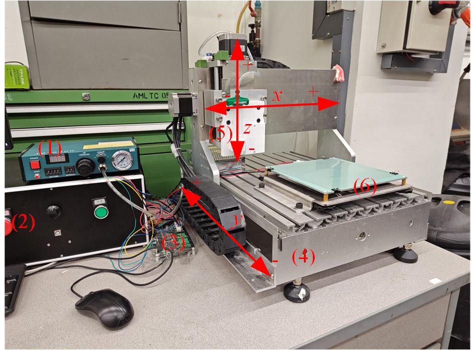

The platform consists of a controller board, fluid dispenser, and a 3-axis motion platform. The wiring connections between components are illustrated below:

> **Figure 2.** DIW platform wiring diagram.
>
> 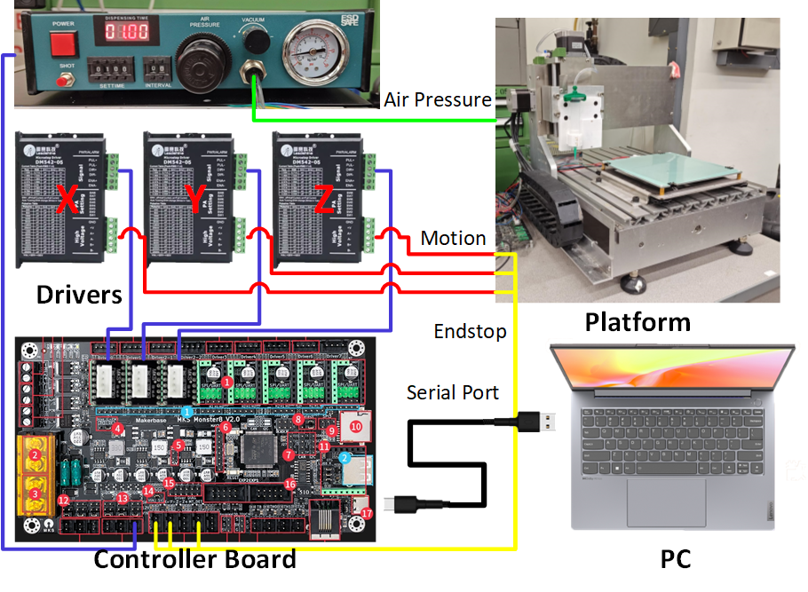

## 1.1 System Overview

| Component | Specification |
|-----------|---------------|
| Controller | MKS-Monster8 (STM32F407VET6, 168MHz) |
| Motors | 57 stepper motors × 3 axes |
| Dispenser | JND-983A pneumatic dispensing valve |
| Nozzles | 0.4 mm / 0.8mm diameter |
| Firmware | Marlin 2.1.2.4 (customized) |
| Slicer | PrusaSlicer 2.7.4 |
| Host Software | Pronterface |

## 1.2 Controller Board & Firmware

The controller uses the [MKS-Monster8](https://github.com/makerbase-mks/MKS-Monster8) board from [MakerBase](https://makerbase.com.cn/), supporting mainstream 3D printing firmware (Marlin, Klipper).

> **Figure 3.** MKS-Monster8 controller board.
>
> 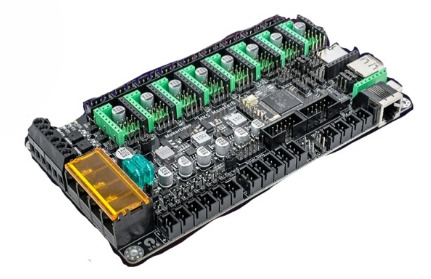

**References:** [GitHub](https://github.com/makerbase-mks/MKS-Monster8) | [Video Guide](https://www.bilibili.com/video/BV11h411x7KH) | [Marlin Setup](https://blog.csdn.net/gjy_skyblue/article/details/120348539) | [Klipper Setup](https://blog.csdn.net/gjy_skyblue/article/details/120472942)

### Technical Parameters

- **MCU:** STM32F407VET6 (168MHz, 512KB Flash, 192KB RAM)
- **Power Supply:** DC 12-24V input (2× MP1584EN outputs: DC12V for fans, DC5V)
- **Fans:** 3× PWM fans + 3× power outputs (selectable via jumper: VIN/DC12V/DC5V)
- **Motors:** 9 driver interfaces (Driver 0-7)
- **Displays:** EXP1/EXP2 for MKS MINI12864, MKS TS35, LCD12864, LCD2004
- **Serial:** USART1 (PA9/PA10) for MKS Robin or custom serial communication
- **Endstops:** 6 inputs with power selection (X-, X+, Y-, Y+, Z-, Z+) + 3D TOUCH (PA8)
- **Storage:** 4KB EEPROM (I2C), onboard microSD card (SPI)
- **Communication:** CAN transceiver, SPI interface, virtual USB device, UDISK
- **Drivers:** TMC UART/SPI modes, SENSORLESS_HOMING (Diag0-5)
- **Driver Voltage:** Selectable 5V/3.3V
- **Protection:** TVS spike protection, reverse connection protection
- **Boot Mode:** DFU via Boot0 button

> **Figure 4-5.** Pinout and connector layout.
>
> 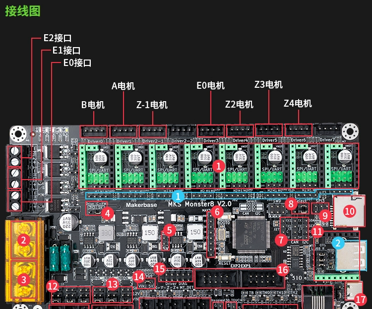 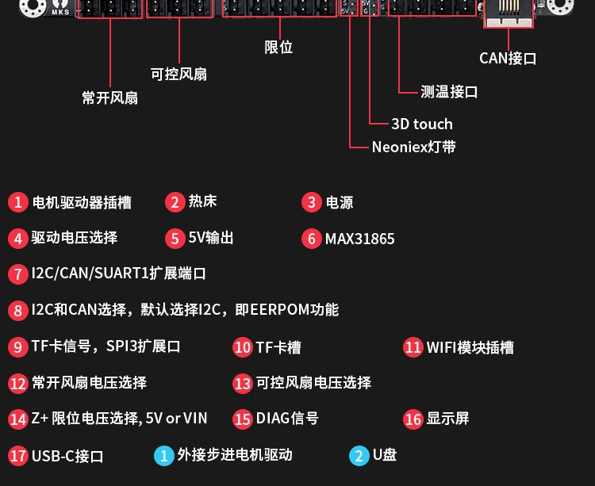

### Wiring Configuration

Our platform controls X/Y/Z axes only — no extrusion heating is required. The hot bed is reserved for the substrate, and the fan control port is repurposed for air pressure switch control and limit switches.

> **Figure 6.** Control board wiring for DIW platform.
>
> 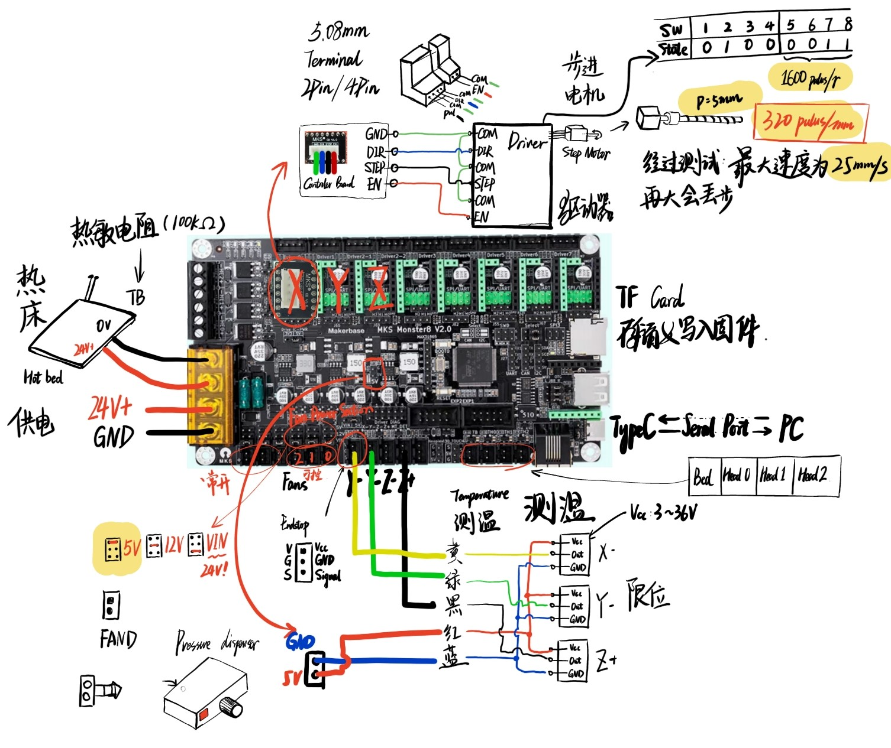

### Firmware Configuration

> **Note:** Only modify the firmware if you need to adjust parameters or troubleshoot. The default configuration requires no changes.

[Marlin](https://marlinfw.org/) is the most widely used open-source 3D printing firmware. Key customizations for this platform:

1. **G05 spline interpolation** — enabled for smooth motion
2. **XYZ 3-axis configuration** — pulse equivalent set (pulses per mm for each axis)
3. **Cold extrusion protection disabled** — temperature sensor off, minimum extrusion temperature set to 0°C
4. **Build volume** — adjusted to match actual travel range
5. **Homing direction** — set to X-, Y-, Z+

**Development Environment:** VS Code with PlatformIO extension

**Resources:**
- Marlin official: https://marlinfw.org/
- Original config: https://github.com/MarlinFirmware/Configurations/tree/release-2.1.2.4
- Custom Marlin build: https://lecloud.lenovo.com/share/2JQMt9CWcRS9uVE4x (password: `pgjg`)

## 1.3 Stepper Motors, Drivers & Endstops

### Stepper Motors

The platform uses **57-series stepper motors** (NEMA-23) for all three axes.

**Working Principle:** Position control via pulse signals. Each pulse rotates the motor by a specific angle. For a standard 57 stepper:

- **Step angle (θ):** 0.8° (1 pulse = 0.8° rotation)
- **Microstepping:** Driver divides each step by coefficient `n`, effective step angle = θ/n
- **Accuracy note:** Microstepping beyond 32× yields diminishing accuracy returns; higher settings primarily improve smoothness

### Driver Configuration

> **Figure 7.** Driver dip switch settings (highlighted = original configuration used).
>
> 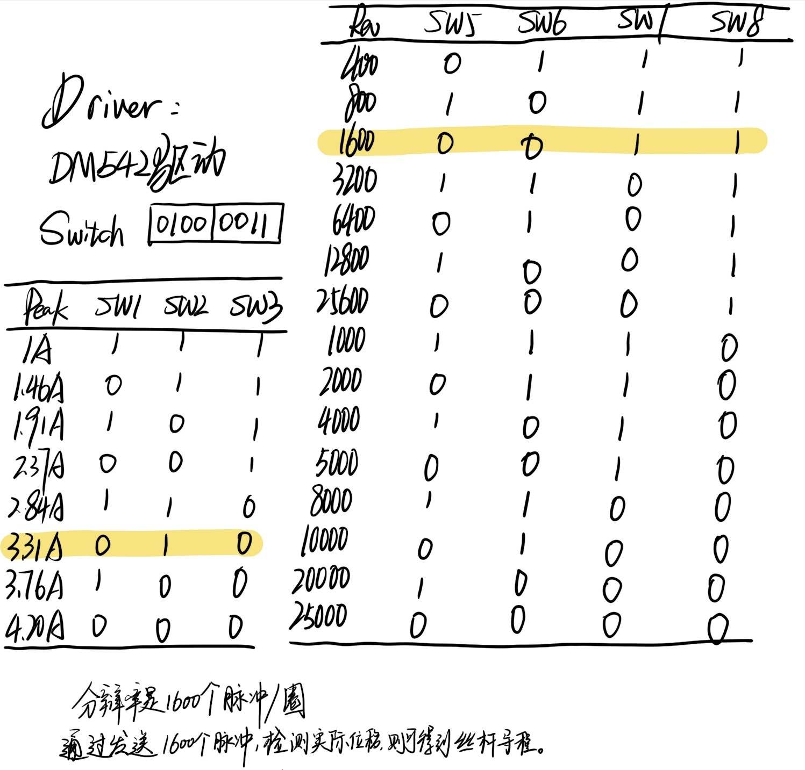

Current peak value and microstepping resolution are configured via dip switches on the driver.

### Motor Wiring

> **Figure 8.** Original stepper motor wiring reference.
>
> 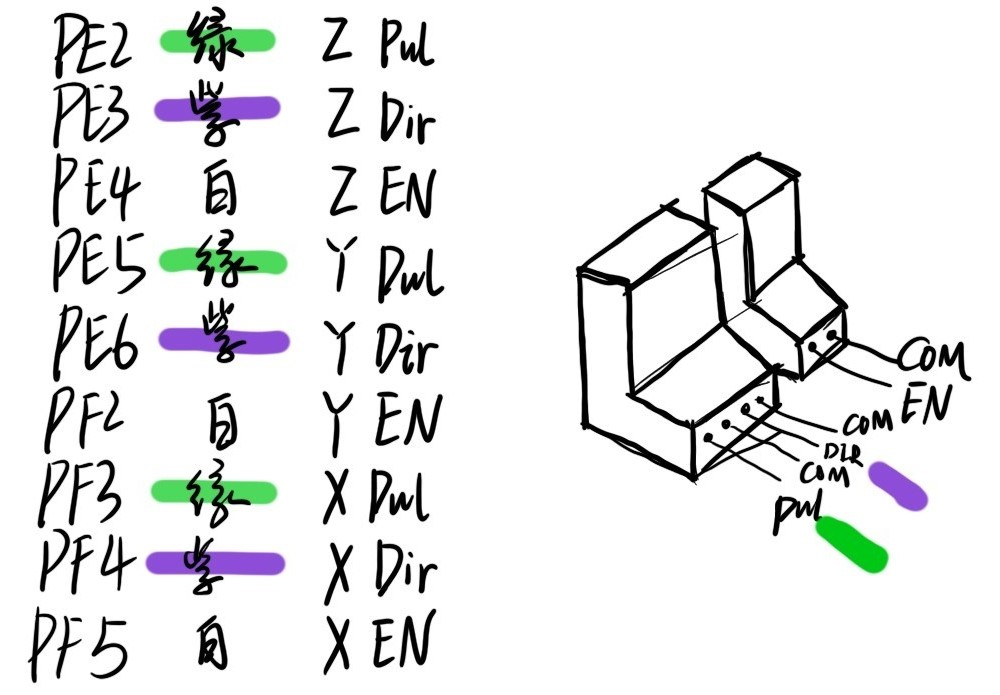

An adapter board interfaces with the controller. Terminals: **COM** (ground), **Enable**, **Pulse**, **Direction**. Wire color coding:

> **Figure 9.** Stepper motor cable color reference.
>
> 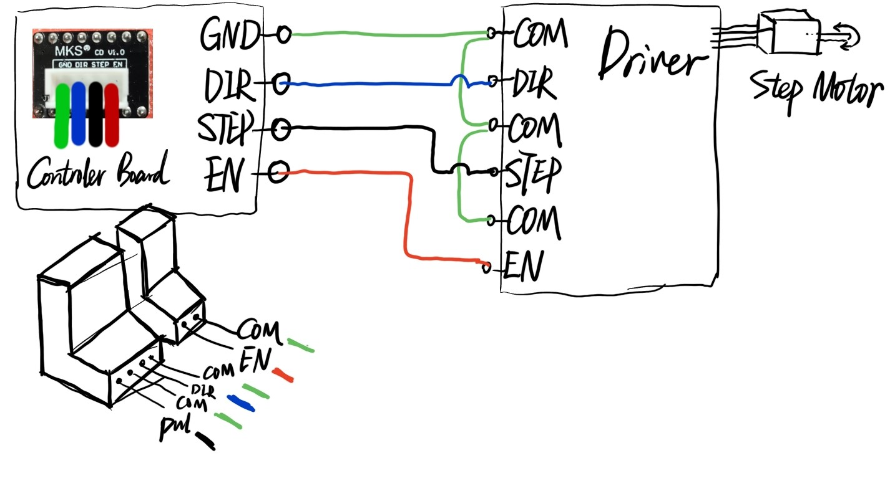

### Endstop Sensors

> **Figure 10.** Endstop wiring configuration.
>
> 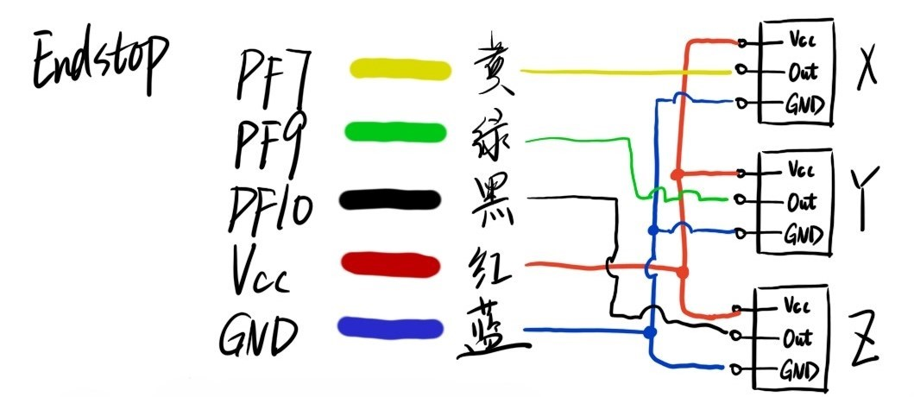

> **⚠️ Important:** The default 5V supply proved unreliable during testing. Endstop sensors require **24V** (rated 0-24V). Adjust the wire connection to select the appropriate voltage — the Z+ endstop supports both voltage options via jumper selection.

## 1.4 Pressure Dispenser

The pneumatic switch is controlled via the fan output port: the controller adjusts the voltage to 24V, triggering a relay module that switches the pressure dispenser on/off.

### Technical Specifications

| Parameter | Value |
|-----------|-------|
| Dispensing Modes | 16 programmable modes with time display |
| Dispensing Time | 0.01–99.99 s |
| Interval Time | 0.1–9.9 s (auto mode) |
| Input Voltage | 220V±10% 50Hz / 110V±10% 60Hz |
| Control Voltage | 12VDC / 24VDC |
| Input Pressure | 10–100 PSI |
| Output Pressure | 1–80 PSI |
| Dimensions | 235×225×63 mm |
| Weight | 2.8 kg |

### Mode Configuration

The 4-position DIP switch on the rear panel selects between 16 dispensing modes. Full manual: [JND-983A dispensing guide](./assets/JND-983A点胶机详细功能设置.docx)

| Mode | S1 | S2 | S3 | S4 | Function |
|:----:|:--:|:--:|:--:|:--:|----------|
| **1** | Off | Off | Off | Off | **Inching** — hold to extrude, release to stop |
| 2 | On | Off | On | On | Hold — press once to start timed extrusion, press again to stop |
| 3 | Off | On | On | On | Inching timing — hold for timed extrusion |
| 4 | On | On | On | On | Auto continuous — extrude according to set time |
| 5 | On | Off | Off | Off | Single-shot — 1 dispense per press |
| 6 | Off | On | Off | Off | Single-shot — 2 dispenses per press |
| 7 | On | On | Off | Off | Single-shot — 3 dispenses per press |
| 8 | Off | Off | On | Off | Single-shot — 4 dispenses per press |
| 9 | On | Off | On | Off | Single-shot — 5 dispenses per press |
| 10 | Off | On | On | Off | Single-shot — 6 dispenses per press |
| 11 | On | On | On | Off | Single-shot — 7 dispenses per press |
| 12 | Off | Off | Off | On | Single-shot — 8 dispenses per press |
| 13 | On | Off | Off | On | Single-shot — 9 dispenses per press |
| 14 | Off | On | Off | On | Single-shot — 10 dispenses per press |
| 15 | On | On | Off | On | Single-shot — 11 dispenses per press |
| 16 | Off | Off | On | On | Single-shot — 12 dispenses per press |

> **Note:** This platform uses **Mode 1 (Inching)**.

### Operation

1. **Pressure adjustment** — rotate the black knob to set output pressure
2. **Manual trigger** — press the red button on the left side, or use an external foot pedal (modified for program control)

### Additional Resources

- [Syringe barrel 3D model](./assets/3Dmodels/SLDPRT/syringe.zip) (SolidWorks)
- [Nozzle 3D model](./assets/3Dmodels/SLDPRT/tips.rar) (SolidWorks)
- [Nozzle data sheet](./assets/技术表格.pdf)

---

# 2. Getting Started

> **Prerequisite:** Request compressed air supply from the Lab admin before first use.

### Workflow Overview

```
3D Model → PrusaSlicer → G-code Editing → Pronterface → Controller Board
                                                  ↓
                                        ┌─────────┴──────────┐
                                        ↓                    ↓
                                 XYZ Stepper Motors    Fan Port (M106/M107)
                                 (position control)    → Relay → Pressure valve
```

The PC sends G-code to the controller board's serial buffer. The board decodes and interpolates the instructions into control signals (enable, direction, pulse) for the stepper motor drivers. Meanwhile, `M106`/`M107` commands control the fan port voltage, triggering the relay to switch the pneumatic valve on/off.

## 2.1 Prepare G-Code

### Slicing Software

#### PrusaSlicer (Recommended)

PrusaSlicer is an actively maintained fork of Slic3r with an active community and fewer bugs.

- **Download:** https://www.prusa3d.com/page/prusaslicer_424/

> **Figure 11.** PrusaSlicer interface.
>
> 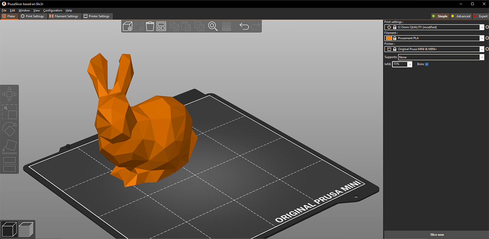

Customized profiles for the AML DIW platform are provided for both **0.4mm**[^8] and **0.8mm**[^9] nozzles.

#### Slic3r (Legacy)

> ⚠️ Slic3r is no longer maintained and contains known bugs. Use PrusaSlicer instead.

- **Download:** https://slic3r.org/

> **Figure 12.** Slic3r interface.
>
> 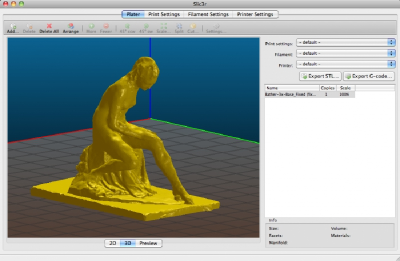

## 2.2 Connection & Communication

### Step 1: Connect Controller to PC

Connect the controller board via USB. Identify the COM port:

- **Windows 10 and earlier:** Right-click "This PC" → Manage → Device Manager → Ports (COM & LPT)
- **Windows 11:** Shift + Right-click "This PC" → Manage → Device Manager → Ports (COM & LPT)

> **Figure 13.** Identifying the COM port in Device Manager.
>
> 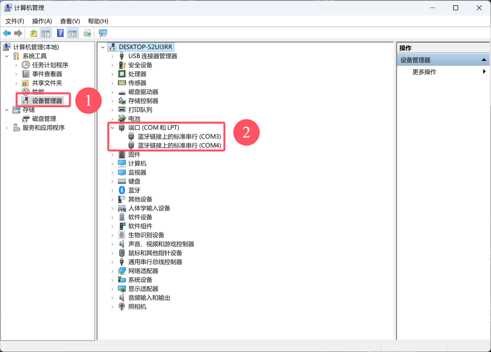

### Step 2: Open Pronterface

**Pronterface** is the host interface for sending G-code to the controller.

- **Download:** https://www.pronterface.com/

> **Figure 14.** Pronterface interface.
>
> 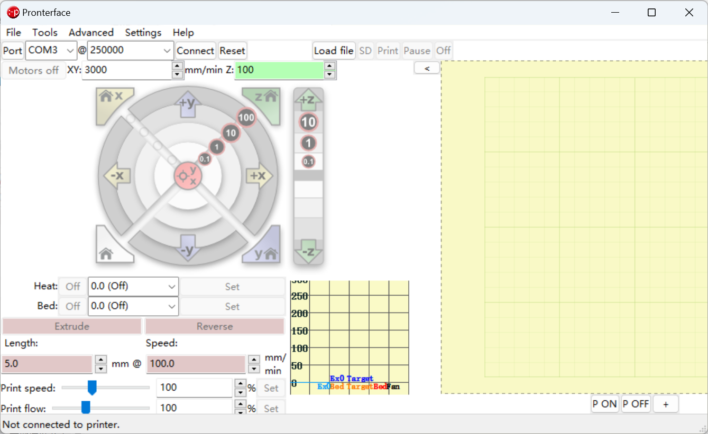

Select the correct COM port and baud rate, then click **Connect**:

> **Figure 15.** Establishing connection in Pronterface.
>
> 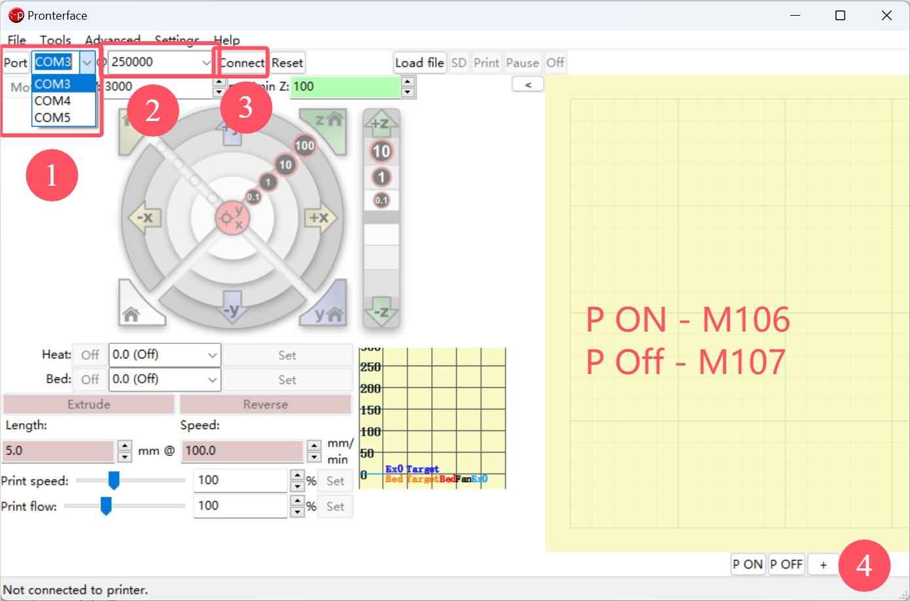

Verify the connection by manually controlling each axis and the pneumatic switch.

> **Tip:** Marlin G-code reference — https://marlinfw.org/meta/gcode/

---

# 3. Tips & Troubleshooting

## Editing G-code with Notepad++

[Notepad++](https://notepad-plus-plus.org/downloads/) supports macro recording, which is invaluable for batch G-code editing.

> **Figure 16.** Macro recording in Notepad++.
>
> 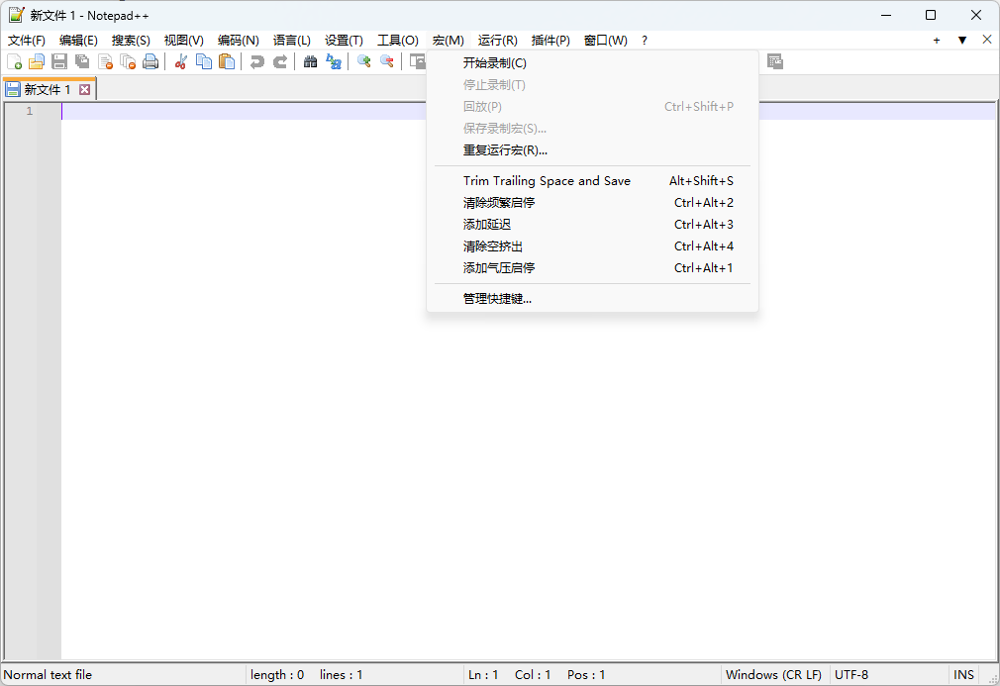

### Macro Recording Best Practices

1. **Use keyboard shortcuts** — avoid mouse clicks during recording. Use `Home`/`End` instead of arrow keys to move the cursor
2. **Mind the end cursor position** — ensure the final cursor position doesn't cause the macro's search to loop infinitely
3. **Use escape characters** — e.g., replace `M106\nM106` (duplicate lines) with a single `M106` using regex search/replace

## Common Issues

| Issue | Solution |
|-------|----------|
| Endstops not triggering | Verify 24V supply (5V is insufficient) |
| Inconsistent extrusion | Check compressed air pressure (10-100 PSI input, 1-80 PSI output) |
| Firmware won't compile | Use VS Code + PlatformIO; verify correct board settings |
| Pronterface can't connect | Confirm COM port and baud rate match the firmware configuration |

---

## Support Materials

| # | Resource | Link |
|---|----------|------|
| 1 | Pressure dispenser manual | [JND-983A 点胶机详细功能设置.docx](./assets/JND-983A点胶机详细功能设置.docx) |
| 2 | Syringe barrel 3D model (SLDPRT) | [syringe.zip](./assets/3Dmodels/SLDPRT/syringe.zip) |
| 3 | Nozzle 3D model (SLDPRT) | [tips.rar](./assets/3Dmodels/SLDPRT/tips.rar) |
| 4 | Nozzle data sheet | [技术表格.pdf](./assets/技术表格.pdf) |
| 5 | Assembly — Z-axis carriage (STEP) | [Assembly-Carriage-Z.STEP](./assets/3Dmodels/STP/Assembly-Carriage-Z.STEP) |
| 6 | Printable fixtures (STL) | [STLs](./assets/3Dmodels/STL) |
| 7 | PrusaSlicer profile — 0.41mm nozzle | [Set_Blue.ini](./assets/Set_Blue.ini) |
| 8 | PrusaSlicer profile — 0.84mm nozzle | [Set_Green.ini](./assets/Set_Green.ini) |

[^1]: [Pressure dispenser manual](./assets/JND-983A点胶机详细功能设置.docx)
[^2]: [Syringe barrel 3D model](./assets/3Dmodels/SLDPRT/syringe.zip)
[^3]: [Nozzle 3D model](./assets/3Dmodels/SLDPRT/tips.rar)
[^4]: [Nozzle data sheet](./assets/技术表格.pdf)
[^5]: ~~[Customized Marlin firmware](./assets/Marlin-NUS.zip)~~ (archived)
[^6]: [Z-axis carriage assembly (STEP)](./assets/3Dmodels/STP/Assembly-Carriage-Z.STEP)
[^7]: [Printable fixtures (STL)](./assets/3Dmodels/STL)
[^8]: [0.41mm nozzle PrusaSlicer profile](./assets/Set_Blue.ini)
[^9]: [0.84mm nozzle PrusaSlicer profile](./assets/Set_Green.ini)

---

> **Maintained by** NUS CDE AML Lab · **License:** [GPL v3](LICENSE) · **Last updated:** 2024-10-22

