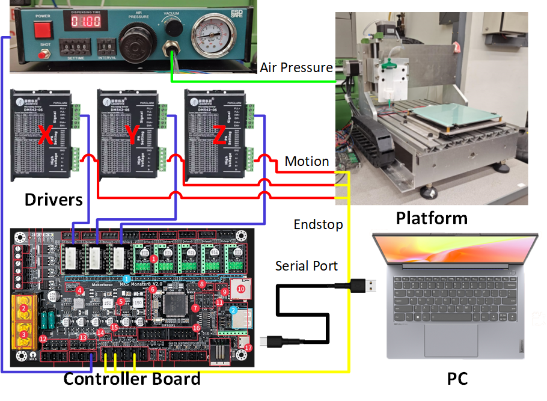
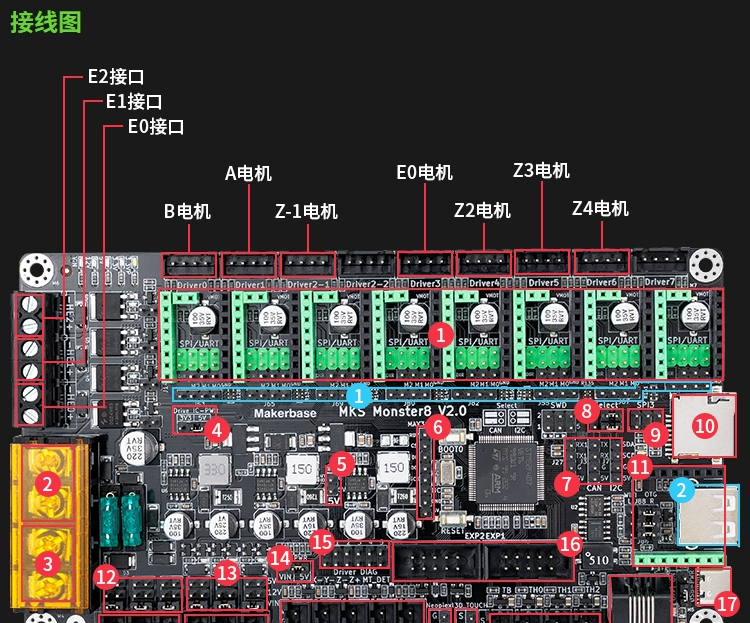
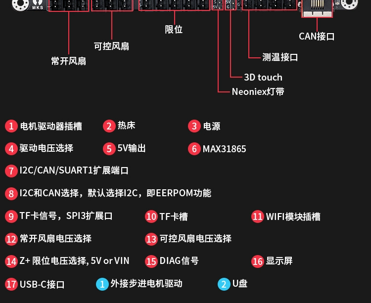
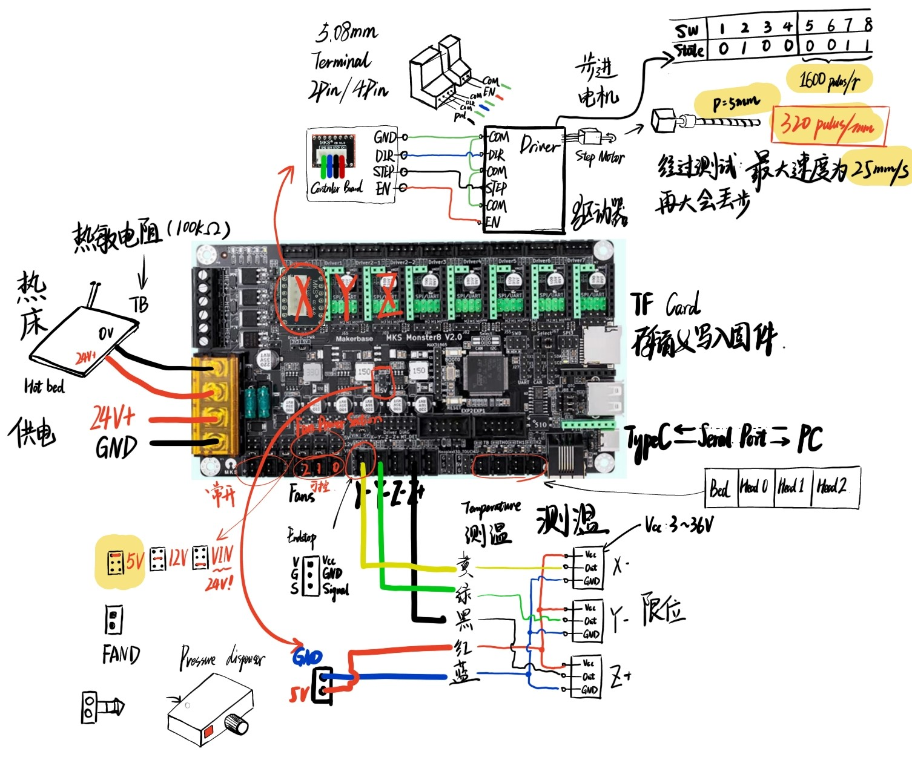
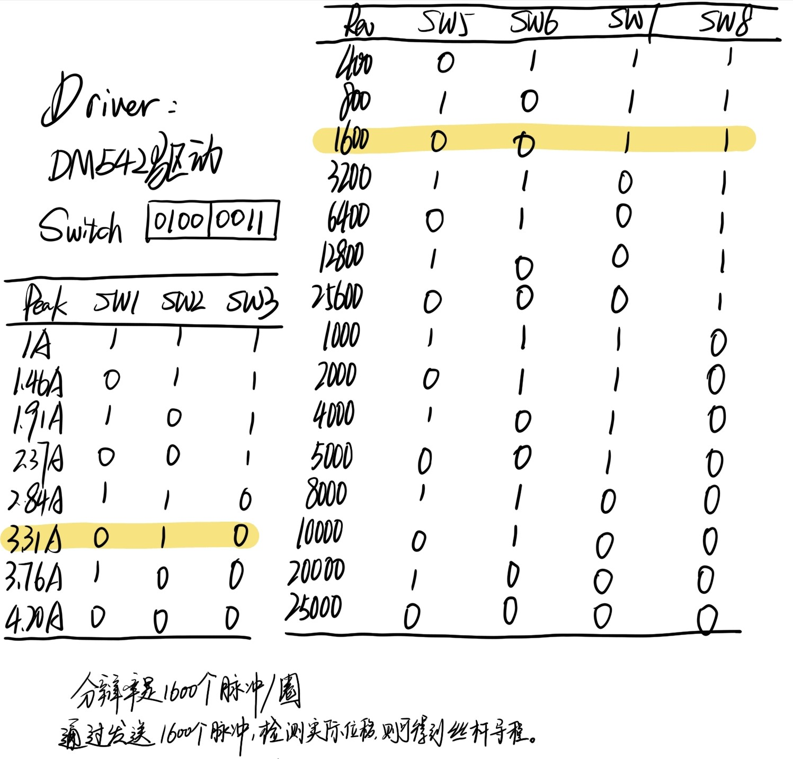
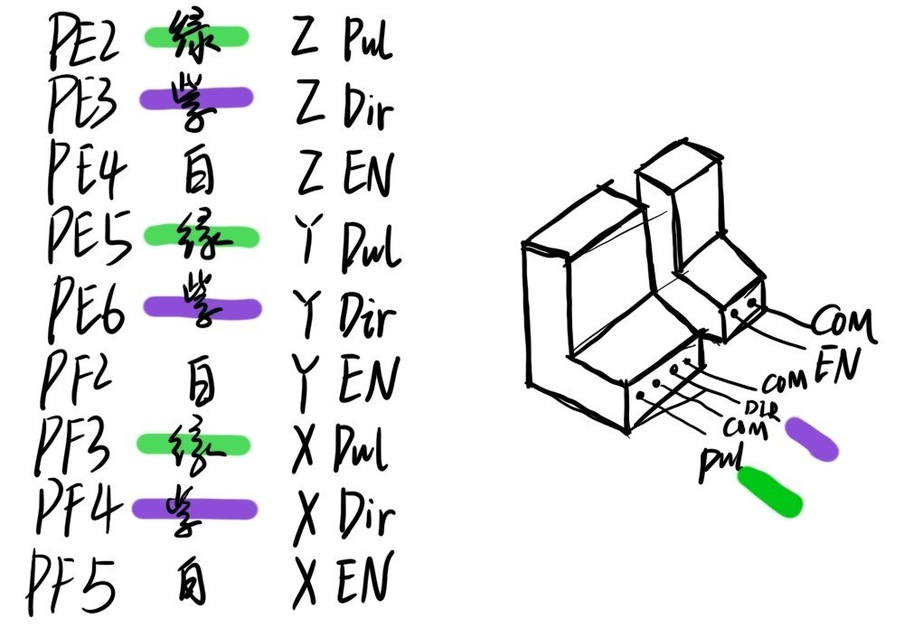
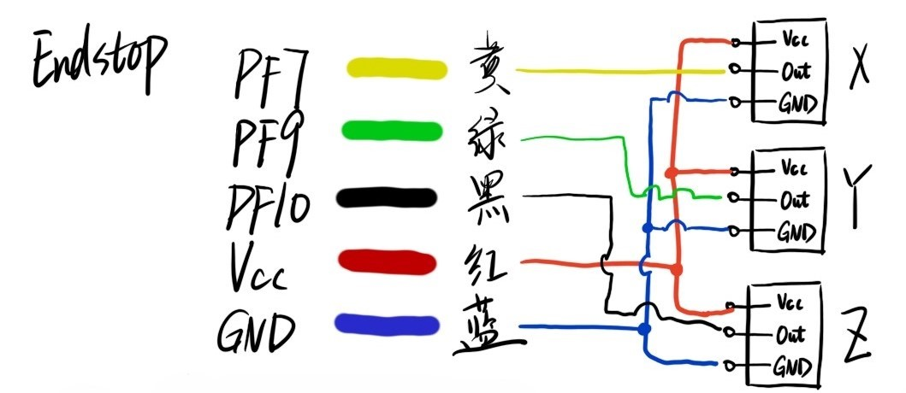
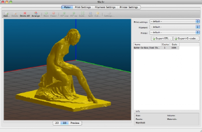
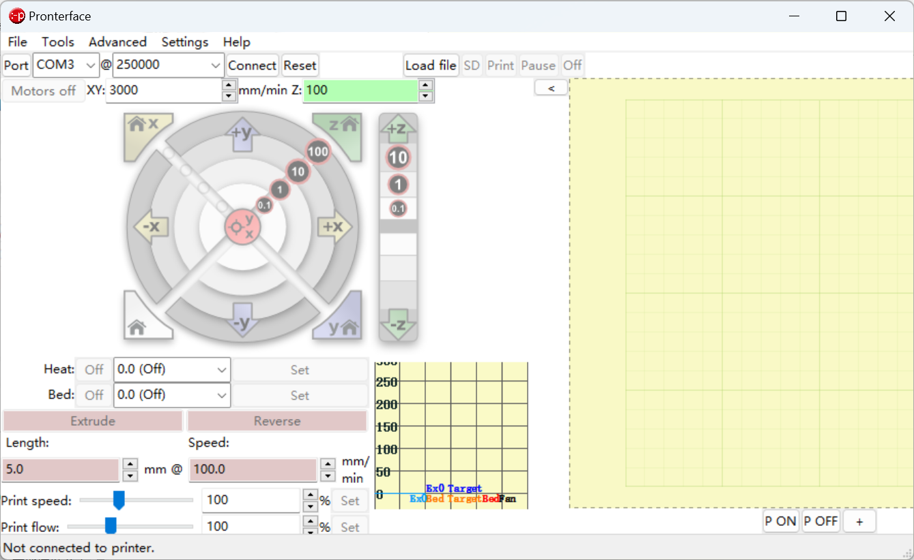
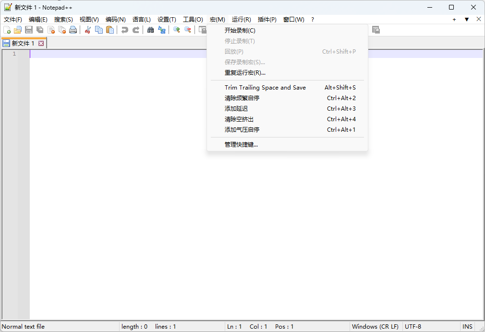

# Material Extrusion 3D printing platform @ NUS CDE AML

# Content

[TOC]

# 1. Introduction

Fixture[^7] and assembly[^6] are here.

 Fluid dispenser, (2) Step Motor Driver box, (3) Controller board, (4) Motion control platform, (5) Syringe barrel, (6) Substrate.")

As show above, The platform include controller board, fluid dispenser, and a 3-Axis platform. They are connected as below: 

## (1) Controller Board and Firmware

The control board uses the [MKS-Monster8](https://github.com/makerbase-mks/MKS-Monster8) control board from [MakerBase](https://makerbase.com.cn/). This control board supports mainstream 3D printing firmware such as Marlin and Klipper. 

You can find more information from [GitHub](https://github.com/makerbase-mks/MKS-Monster8), [bilibili](https://www.bilibili.com/video/BV11h411x7KH?spm id from=333.999.0.0), [Manual to set Marlin 2.0.X](https://blog.csdn.net/gjy_skyblue/article/details/120348539), [Manual to set Klipper](https://blog.csdn.net/gjy_skyblue/article/details/120472942?spm=1001.2014.3001.5501).

### a. Technical Parameters

- MCU: STM32F407VET6, 168MHz, 512K flash, 192KB RAM
- Power Supply：DC12-24V input(2 MP1584EN Output DC12V(For FANs) and DC5V)
- 3 PWM FANs + 3 power output(all power can be select by jumper and select VIN, dc12V, dc5V)
- axis drivers and 9 motor interface(Driver0,1,2-1,2-2,3,4,5,6,7)
- EXP1,EXP2 support MKS MINI12864,MKS TS35,LCD12864,LCD2004
- USART(usart1:PA9,PA10) support MKS H43 or for other serial communication
- 6 endstop support power select(X-,X+,Y-,Y+,Z-,Z+) and 3D TOUCH(PA8) interface
- 4K eeprom on board(connect to I2C)
- Built-in CAN transceiver and interface(connect to CAN)
- Integrated SPI communication microsd card and reserved SPI signal interface
- Integrated UDISK
- Integrated virtural USB device
- Support TMC UART and SPI mode, SENSORLESS_HOMING function(Diag0-5,connect to X-,Y-,Z-,X+,Y+,Z+)
- Support driver power select(5V or 3.3V)
- Has TVS power spike protection
- Possess power reverse connection protection function
- Support DFU mode set by button(Boot0)

### b. Wire Connection

However, our platform needs to use the control of X, Y, and Z axes, no extrusion heating requirements, a hot bed reserved for the substrate, and the fan control port reserved for air pressure switch control and limit switch. Considering the above, the general wiring scheme is as follows:

### c. Firmware

**Attention**: This part is in case you need to adjust firmware or fix. Otherwise no need to make any adjustment.

[Marlin](https://marlinfw.org/) is the most commonly used open source 3D printing firmware. We have modified it accordingly to meet the needs of the device:

1. Enable G05 spline interpolation
2. Enable XYZ3 axes and set the pulse equivalent (the number of pulses corresponding to 1mm movement of each axis)
3. Turn off the extruder cold extrusion limit (disable the temperature sensor and set the minimum extrusion temperature to 0℃)
4. Adjust the configuration printing range according to the actual travel range.
5. Set the return to zero direction to X-, Y-, Z+

Programming environment: Use the PlatformIO plug-in in the VScode environment.

Marlin official website: https://marlinfw.org/

Original Marlin resources: https://github.com/MarlinFirmware/Configurations/tree/release-2.1.2.4

Customized Marlin resources: https://lecloud.lenovo.com/share/2JQMt9CWcRS9uVE4x （密码：pgjg）

## (2) Step Motor, Driver and endstop

### a. Step Motor

The motor used is a 57 stepper motor.

The stepper motor is first connected to the driver, which needs to be powered and connected to the control board.

Its control mode is position control mode, that is, each time a pulse is sent, the stepper motor rotates a specific angle according to the driver's setting. For a 57 stepper motor, the step angle θ is 0.8° (that is, 1 pulse corresponds to a 0.8° rotation of the motor shaft), and the driver can set the coefficient n, so that the step angle becomes θ/n, thereby improving the motion accuracy. However, this improvement is also limited. It is generally believed that when the subdivision number is greater than 32, the effect of improving the accuracy will become limited. When the subdivision number is higher than 32, the main contribution is to improve the smoothness of the movement.

### b. Driver

I didn't see the brand and model of the drive I was using, but I copied down its settings panel:

The current peak and subdivision can be adjusted by adjusting the driver's dip switches. The original configuration is highlighted, and I used that configuration.

### c. Wire Connection

previous-version wire connection:

Refer to the previous-version method for wiring. It should be pointed out that an adapter board is used to plug directly into the control board, and then the wiring is done. The common terminal (COM) is grounded, and the others include Enable, Pulse, and Direction. And the cable colors correspond to the following figure:

### d. Endstop

During the actual debugging process, it was found that the original vcc 5V could not meet the needs of use, and sometimes there would be a problem of insufficient voltage. The working voltage marked on the sensor is 0~24V, so 24V voltage was selected as the power supply.

As can be seen in the overview diagram, the Z+ endstop voltage selection is mentioned. Here, the applied voltage can be adjusted by adjusting the line connection method.

## (3) Pressure Dispenser

The air pressure switch control is controlled through the Controllable Fan port, the voltage is adjusted to 24V and connected to the relay module, and the other end is connected to the air pressure dispenser (pressure dispenser) to perform air pressure switch control (switch control).

### a. Technical indicators：

1. Dispensing mode: 16 freely set modes, with dispensing time display*
2. Automatic timing dispensing: 00.01S-99.99S
3. Dispensing interval time: 0.1-9.9S (automatic timing function)
4. Input voltage: 220V±10% 50Hz/110V±10% 60Hz
5. Internal voltage: 12VDC/24VDC
6. Input air pressure: 10-100pSi
7. Output air pressure: 1-80 pSi
8. Dimensions: 235×225×63mm
9. Weight: 2.8kg

### b. Instructions:

Refer to Manual of pressure dispenser[^1]:

The SETUP four-position dispensing time programmer DIP switch on the back can be used to select 16 dispensing modes by toggling it. The mode combination settings are as follows:

<table>
<capital>Mode Sets</capital>
<tr>
<th rowspan=2 align="center">No.</th>
<th colspan=4 align="center">Switch status</th>
<th rowspan=2 align="center">Function</th>
</tr>
<tr>
<th align="center">S1</th>
<th align="center">S2</th>
<th align="center">S3</th>
<th align="center">S4</th>
</tr>
<tr>
<th align="center">1</th>
<th align="center">Off</th>
<th align="center">Off</th>
<th align="center">Off</th>
<th align="center">Off</th>
<th align="left">  Inching mode, press/depress and hold to maintain extrusion</th>
</tr>
<tr>
<th align="center">2</th>
<th align="center">On</th>
<th align="center">Off</th>
<th align="center">On</th>
<th align="center">On</th>
<th align="left">  Hold mode: press/depress the switch once to continue extrusion for the set time; press/depress the switch again to stop extrusion.</th>
</tr>
<tr>
<th align="center">3</th>
<th align="center">Off</th>
<th align="center">On</th>
<th align="center">On</th>
<th align="center">On</th>
<th align="left">  Inching timing mode, press/depress and hold to maintain the extrusion time</th>
</tr>
<tr>
<th align="center">4</th>
<th align="center">On</th>
<th align="center">On</th>
<th align="center">On</th>
<th align="center">On</th>
<th align="left">  Automatically and continuously extrude according to the set time</th>
</tr>
<tr>
<th align="center">5</th>
<th align="center">On</th>
<th align="center">Off</th>
<th align="center">Off</th>
<th align="center">Off</th>
<th align="left">  Press/depress the switch once to squeeze out 1 time according to the set time.</th>
</tr>
<tr>
<th align="center">6</th>
<th align="center">Off</th>
<th align="center">On</th>
<th align="center">Off</th>
<th align="center">Off</th>
<th align="left">  Press/depress the switch once to squeeze out 2 times according to the set time.</th>
</tr>
<tr>
<th align="center">7</th>
<th align="center">On</th>
<th align="center">On</th>
<th align="center">Off</th>
<th align="center">Off</th>
<th align="left">  Press/depress the switch once to squeeze out 3 times according to the set time.</th>
</tr>
<tr>
<th align="center">8</th>
<th align="center">Off</th>
<th align="center">Off</th>
<th align="center">On</th>
<th align="center">Off</th>
<th align="left">  Press/depress the switch once to squeeze out 4 times according to the set time.</th>
</tr>
<tr>
<th align="center">9</th>
<th align="center">On</th>
<th align="center">Off</th>
<th align="center">On</th>
<th align="center">Off</th>
<th align="left">  Press/depress the switch once to squeeze out 5 times according to the set time.</th>
</tr>
<tr>
<th align="center">10</th>
<th align="center">Off</th>
<th align="center">On</th>
<th align="center">On</th>
<th align="center">Off</th>
<th align="left">  Press/depress the switch once to squeeze out 6 times according to the set time.</th>
</tr>
<tr>
<th align="center">11</th>
<th align="center">On</th>
<th align="center">On</th>
<th align="center">On</th>
<th align="center">Off</th>
<th align="left">  Press/depress the switch once to squeeze out 7 times according to the set time.</th>
</tr>
<tr>
<th align="center">12</th>
<th align="center">Off</th>
<th align="center">Off</th>
<th align="center">Off</th>
<th align="center">On</th>
<th align="left">  Press/depress the switch once to squeeze out 8 times according to the set time.</th>
</tr>
<tr>
<th align="center">13</th>
<th align="center">On</th>
<th align="center">Off</th>
<th align="center">Off</th>
<th align="center">On</th>
<th align="left">  Press/depress the switch once to squeeze out 9 times according to the set time.</th>
</tr>
<tr>
<th align="center">14</th>
<th align="center">Off</th>
<th align="center">On</th>
<th align="center">Off</th>
<th align="center">On</th>
<th align="left">  Press/depress the switch once to squeeze out 10 times according to the set time.</th>
</tr>
<tr>
<th align="center">15</th>
<th align="center">On</th>
<th align="center">On</th>
<th align="center">Off</th>
<th align="center">On</th>
<th align="left">  Press/depress the switch once to squeeze out 11 times according to the set time.</th>
</tr>
<tr>
<th align="center">16</th>
<th align="center">Off</th>
<th align="center">Off</th>
<th align="center">On</th>
<th align="center">On</th>
<th align="left">  Press/depress the switch once to squeeze out 12 times according to the set time.</th>
</tr>
</table>

The mode actually used is Set 1.

### c. Operation

1. Pressure adjustment: Adjust the air pressure by adjusting the black knob
2. Switch: You can press the small red button on the left to adjust manually, or you can use an external pedal to adjust manually (this interface has been modified for program control); the control method is detailed in the manual.

### d. Additional Material

3D model of Syringe Barrel[^2] and Nozzle[^3], and data sheet of Nozzle[^4] are provided. 

# 2. Get Start

**Before start** one need to ask Lab admin to provide compressed air.

1. First we need to get the G code (generated by slicing, optimized and edited). 
2. Then we need to connect the control board to the computer, open the user interface, establish serial communication, and then import the G code file to start printing. 
3. During the printing process, the PC sends the G code to the buffer area of the control board through the serial port. The control board continuously reads the instructions in the buffer, and converts them into control signals through decoding and interpolation: enable, direction, pulse, and send them to the stepper motor driver, and then the driver controls the movement of the stepper motor.
4. The PC sends M106/M107 commands to the control board, which regulates the voltage of the port originally designated for fan switch control. This voltage change triggers the connected relay, thereby enabling switch control of the external interface reserved for the air pressure distributor, achieving the on/off switching of the air pressure.

## (1) Prepare G-Code

### a. Slicing software

#### ① Slic3r

Slic3r is an open source slicing software, but it has stopped development, so there are some bugs.

Web：https://slic3r.org/

#### ② PrusaSlicer

PrusaSlicer is a fork of Slic3r, which is still under development and has a relatively active community. I used Slic3r before, but because of too many bugs, I have now switched to PrusaSlicer.

Web：https://www.prusa3d.com/page/prusaslicer_424/

Customized configurations have been made for AML's DIW equipment, and configurations suitable for 0.4mm nozzles[^8] and 0.8mm nozzles[^9] can be found in the supporting materials.

## (2) Connection and communication

### a. Connect control board to PC

### b. user interface: pronterface

Web: https://www.pronterface.com/

This computer [Win XP ~ Win10: right-click; Win11: Shift + right-click] → Manage [Open "Computer Management"] → Click Device Manager → Check the port (find the new port that appears after connecting the control board and remember it)

Select the appropriate port and baud rate to establish a connection:

Manually control the movement of each axis and the air pressure switch to test whether the connection is successful.

#### tips:

G-code command can be found from: https://marlinfw.org/meta/gcode/

# 3 Tips

## (1) Using Notepad++ to edit .gcode file.

Notepad++ ([Downloads | Notepad++ (notepad-plus-plus.org)](https://notepad-plus-plus.org/downloads/)) supports macro recording, which meets our needs in terms of functionality and, as far as I know, is irreplaceable.

It needs to be stated that the author of this software violated the One China Principle, and the author of this manual opposes any form of national division.

#### tips:

1. When recording a macro, try to avoid using the mouse and use the keyboard. In addition, each step should be as simple as possible. For example, to move the cursor to the beginning of a line, use "Home" instead of multiple "←".
2. When recording a macro, consider the cursor position at the end to avoid the search in the macro falling into an infinite loop.
3. Use escape characters flexibly. Two consecutive lines of M106 are described as "M106\nM106" using escape characters. By replacing all of them with "M106" multiple times, duplicate items can be eliminated.

# Support Materials

[^1]: [Manual of pressure dispenser](.\assets\JND-983A点胶机详细功能设置.docx)
[^2]: [3D model of syringe](.\assets\3Dmodels\SLDPRT\syringe.zip) 
[^3]: [3D model of nozzle](.\assets\3Dmodels\SLDPRT\tips.rar) 
[^4]: [Data sheet of nozzle](.\assets\技术表格.pdf) 
[^5]: [~~Customized Marlin firmware for AML DIW printer~~](.\assets\Marlin-NUS.zip)
[^6]: [Assembly-Carriage-Z.STEP](.\assets\3Dmodels\STP\Assembly-Carriage-Z.STEP)
[^7]: [STLs](.\assets\3Dmodels\STL)

[^8]: [0.41mm nozzles setting](assets\Set_Blue.ini)
[^9]: [0.84mm nozzles setting](assets\Set_Green.ini)

